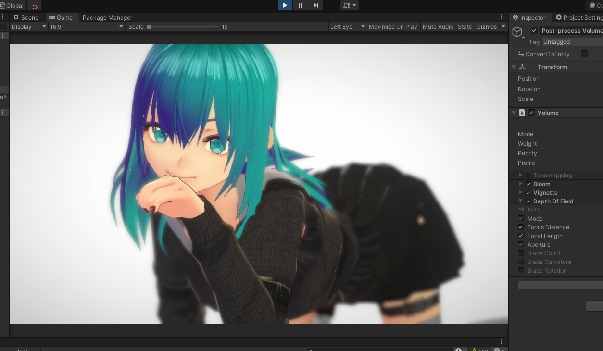
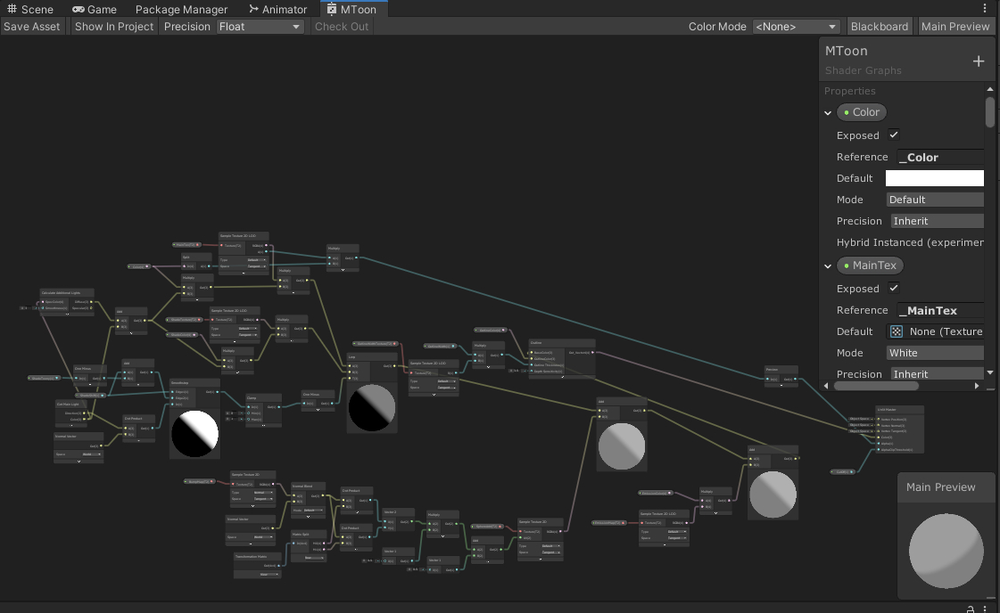

# Shader Graphs MToon for URP VR

New URP Toon Shader -> https://github.com/simplestargame/SimpleURPToonLitOutlineExample

This repository is old.  
This shader does not support the latest UniVRM.

  

## Requirements
- Unity 2019.4.20f1  
    - Universal RP 7.5.3  

## Getting Started

Open SimplestarGame/ShaderGraphsMToon/Scenes/SampleScene  

Play VR Single Pass Stereo Rendering Mode.

A cube GameObject has the MToon Shader.  

  

## Check Example VRM Scene

1. Find VRMMaterialImporter if you use [UniVRM package](https://github.com/vrm-c/UniVRM)  
    Edit lines as follows.
 ```cs
 // 1 select shader
 var shaderName = item.shader;
 ↓
 var shaderName = "Shader Graphs/MToon";//item.shader;

 // 2 use geometry queue
 material.renderQueue = item.renderQueue;
 ↓
 material.renderQueue = (int)UnityEngine.Rendering.RenderQueue.GeometryLast < item.renderQueue ? (int)UnityEngine.Rendering.RenderQueue.GeometryLast : item.renderQueue;
 ```
Load Result in SimpleViewer scene of [UniVRM Sample package](https://github.com/vrm-c/UniVRM).

You should learn about [MToon](https://www.slideshare.net/VirtualCast/vrm-mtoon) (Japanese).
